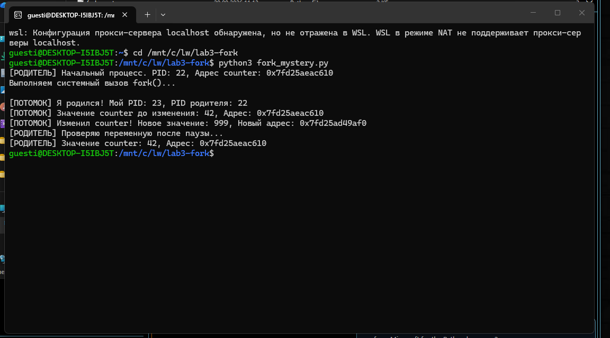

# Лабораторная работа №3 — fork() и Copy-on-Write

## Запуск

В Linux/WSL:

    python3 fork_mystery.py

## Результат

После `fork()` родительский и дочерний процессы показывают одинаковый адрес для числа `42`. Потомок присваивает переменной `999`, но у родителя остаётся `42`.

## Ответы на контрольные вопросы

### 1. Почему адреса одинаковые, а родитель не увидел изменение?

`id()` показывает виртуальный адрес объекта в адресном пространстве процесса. После `fork()` виртуальные адреса у родителя и потомка совпадают. У каждого процесса есть собственная таблица страниц, по которой MMU переводит виртуальные адреса в физические. При записи механизм Copy-on-Write позволяет потомку получить отдельную страницу памяти, поэтому его изменения не затрагивают родителя.

Число `999` имеет другой `id()`, поскольку целые числа в Python неизменяемы: присваивание привязывает имя `shared_counter` к другому объекту.

### 2. Где срабатывает Copy-on-Write и что его запускает?

В программе изменение выполняется строкой `shared_counter = 999`. При попытке записи в защищённую общую страницу процессор вызывает исключение нарушения доступа к странице. Ядро Linux создаёт отдельную копию страницы для записывающего процесса и обновляет его таблицу страниц.

По одному выводу программы нельзя установить, какая именно запись Python после `fork()` первой вызвала физическое копирование: интерпретатор может записывать в память и до указанного присваивания.
